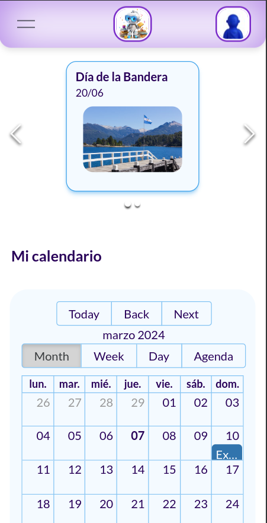

# Rastrea Patitas

<!-- add image by url -->
<br />

<div align="center">


<br />
<div align="center">

  

<h2 align="center">EduClass</h2>

  <p align=center">
  La comunicación entre institución escolar y familias se ven interrumpidas por los grupos de WhatsApp. 
  Mensajes incoherentes que provocan poca fluidez y pérdida de información importante dificultan la organización de las familias.
  EduClass es una herramienta que optimiza la comunicación entre institución escolar y familias por medio de un enlace directo para proyectar transparencia, seguridad y evitar conflictos innecesarios. El publico objetivo son instituciones y familias con hijos escolarizados en instituciones educativas cuyas edades estén entre los 3 y 12 años (Jardín de Infantes/Infantil y Primaria).
    <br />
    <br />
    <a href="https://drive.google.com/file/d/1eKL1FhAuOmEK5E2t4rgkZqxcvEFsZmpX/view?usp=drive_link" target="_blank">Ver Video Demostrativo</a>
    ·
    <a href="https://github.com/No-Country/s13-03-m-node-react/issues" target="_blank">Reportar Bug</a>
  </p>
</div>

<br>
<br>
<hr>
<h1 align="center"> 
Acerca del Proyecto
</h1>


<h2 align='left'>Funcionalidades - User stories:</h2>

<p align='left'>Como padre ocupado, quiero recibir notificaciones del colegio de mis hijos para poder estar informado sobre las actividades escolares y fechas importantes.

- Notificaciones generales de la institución.
- Notificaciones individuales de cada alumno.</p>
<p align='left'>Como padre, quiero poder ver las notas y progresos académicos de mi hijo en tiempo real para poder brindarle apoyo en sus estudios.

- Notas de boletines.
- Notas de profesor para refuerzos académicos.
- Métricas.</p>
<p align='left'>Como padre, quiero recibir notificaciones de la asistencia de mi hijo para asegurarme de que esté presente en clase y cumpliendo con sus obligaciones escolares.

- Asistencias
- Ausencias.
- Justificaciones de las ausencias.
- Retiro antes del horario o entradas tarde.
- Métricas.</p>
<p align='left'>Como padre, quiero recibir notificaciones  de las salidas escolares y autorizarlas o rechazarlas.

- Aviso de visitas suspendidas.
- Cambios de fechas.
- Horarios de llegada o salida.
- Fotos de las salidas.
- Botones autorizar / rechazar / comentarios (opcional) con modal para confirmar con datos del tutor.
</p>
<p align='left'>Como padre, quiero acceder al calendario escolar y a los horarios de clases de mis hijos para poder planificar con anticipación las actividades familiares. 

- Horarios de clases.
- Cambios de horarios.
- Eventos importantes para la institución</p>


<br>
<br>
<hr>
<h1 align="center"> 
Tecnologías Utilizadas
</h1>


<br>
<br>
<hr>
<h1 align="center"> 
Herramientas para la Organización de Tareas
</h1>

<a href="https://trello.com/b/Q0G3my8O/sb-klinika" target="_blank">
  
</a>

<a href="https://www.nocountry.tech/" target="_blank">
  
</a>

<a href="https://discord.gg/Zj2GmPwg" target="_blank">
  
</a>


<br>
<br>
<hr>
<h1 align="center"> 
Instrucciones para ejecutar la app
</h1>

Instrucciones para clonar el repo y ejecutar el proyecto localmente: 

1- Clonar este repositorio
   ```sh
   git clone https://github.com/No-Country/s13-03-m-node-react.git
   ```

2- Abrir la terminal y correr el comando:
  ```sh
  cd front/
  ```
3- Finalmente ejecutar los comandos:
  ```sh
  npm install
  npm run dev
  ```

O simplemente clickear en el link de 
<a href="https://educlass-two.vercel.app/" target="_blank">Visitar App</a>

<br>
<br>
<hr>
<h1 align="center"> 
Guía Básica de uso
</h1>

<p align='left'>Para usar la app como usuario (tutor responsable), previamente debe recibir código del estudiante en la institución educativa. Con tal código se procede a realizar a completar el formulario de registro.</p> 
<p align='left'>Una vez creado el usuario la app por defecto muestra la pagina de login para ingresar email y contraseña.</p> 
<p align='left'>Una vez logueado en la app, la app redirige a la pantalla home tendremos en la parte superior un banner con notificación de evento del dia de la fecha o que se aproxima. Mas abajo sección con tarjetas de Notificaciones y Actividades escolares, que si son cliqueadas redirijan a tales pantallas. Continua luego sección Mi camino académico, con links a Calificaciones y Asistencias. Finalmente en la parte inferior del home tenemos mapa con ubicación de la institución educativa y footer con datos de contacto de la institución.</p> 
<p align='left'>Desde el menu hamburguesa ubicado a la izquierda del header, tenemos acceso a la paginas de Notificaciones, Actividades escolares, Asistencia, Calendario, Calificaciones y Ayuda.</p> 
<p align='left'>Cada una de las pantallas mencionadas en el punto anterior son fácilmente navegables y según el caso ofrecen al usuario diversas formas de interacción como por ejemplo autorizar salidas, solicitar retiro del alumno, justificar inasistencias, chequear agenda de eventos, filtrar notificaciones por tipo, etc.</p> 

<br>
<br>

<hr>
<h1 align="center"> 
Equipo
</h1>

<table>
<tr>
    <td>
      <div align="center">
        <a href="https://www.linkedin.com/in/maria-paz-kitroser-6362b029/" target="_blank" rel="author">
          
        </a>
        <a href="" target="_blank" rel="author">
          <h4 style="margin-top: 1rem;">Maria Paz Kitroser</h4>
          <h4 style="margin-top: 1rem;">UX/UI</h4>
        </a>
        <a href="https://www.linkedin.com/in/maria-paz-kitroser-6362b029/" target="_blank">
          
        </a>
      </div>
    </td>
    <td>
      <div align="center">
        <a href="" target="_blank" rel="author">
          
        </a>
        <a href="" target="_blank" rel="author">
          <h4 style="margin-top: 1rem;">Cecilia Suarez</h4>
          <h4 style="margin-top: 1rem;">UX/UI</h4>
        </a>
        <a href="" target="_blank">
          
        </a>
      </div>
    </td>
    </tr>
  <tr>
    <td>
      <div align="center">
        <a href="https://www.linkedin.com/in/juan-nebbia/" target="_blank" rel="author">
          
        </a>
        <a href="https://github.com/emybr" target="_blank" rel="author">
          <h4 style="margin-top: 1rem;">Emiliano Brizuela</h4>
          <h4 style="margin-top: 1rem;">Back-end Developer</h4>
        </a>
        <a href="https://github.com/emybr" target="_blank">
          
        </a>
        <a href="https://www.linkedin.com/in/emiliano-brizuela-65045466/" target="_blank">
          
        </a>
      </div>
    </td>
    <td>
      <div align="center">
        <a href="" target="_blank" rel="author">
          
        </a>
        <a href="https://github.com/kevod1997" target="_blank" rel="author">
          <h4 style="margin-top: 1rem;">Alejandro Mattias</h4>
          <h4 style="margin-top: 1rem;">Back-end Developer</h4>
        </a>
        <a href="https://github.com/AJMattias?tab=overview&from=2024-03-01&to=2024-03-07" target="_blank">
          
        </a>
        <a href="" target="_blank">
          
        </a>
      </div>
    </td>
    <td>
      <div align="center">
        <a href="" target="_blank" rel="author">
          
        </a>
        <a href="https://github.com/radhamesc-capellan" target="_blank" rel="author">
          <h4 style="margin-top: 1rem;">Radhamés Capellán</h4>
          <h4 style="margin-top: 1rem;">Back-end Developer</h4>
        </a>
        <a href="https://github.com/radhamesc-capellan" target="_blank">
          
        </a>
        <a href="" target="_blank">
          
        </a>
      </div>
    </td>
    </tr>
    <tr>
    <td>
      <div align="center">
        <a href="https://www.linkedin.com/in/emiliopino/" target="_blank" rel="author">
          
        </a>
        <a href="https://github.com/pinoen" target="_blank" rel="author">
          <h4 style="margin-top: 1rem;">Emilio Pino</h4>
          <h4 style="margin-top: 1rem;">Front-end Developer</h4>
        </a>
        <a href="https://github.com/pinoen" target="_blank">
          
        </a>
        <a href="https://www.linkedin.com/in/emiliopino/" target="_blank">
          
        </a>
      </div>
    </td>
    <td>
      <div align="center">
        <a href="https://ar.linkedin.com/in/valentino-indorato" target="_blank" rel="author">
          
        </a>
        <a href="https://github.com/ValentinoIndorato" target="_blank" rel="author">
          <h4 style="margin-top: 1rem;">Valentino Indorato</h4>
          <h4 style="margin-top: 1rem;">Front-end Developer</h4>
        </a>
        <a href="https://github.com/ValentinoIndorato" target="_blank">
          
        </a>
        <a href="https://ar.linkedin.com/in/valentino-indorato" target="_blank">
          
        </a>
      </div>
    </td>
    <td>
      <div align="center">
        <a href="https://www.linkedin.com/in/paula-velez/" target="_blank" rel="author">
          
        </a>
        <a href="https://github.com/PaulaVelezz" target="_blank" rel="author">
          <h4 style="margin-top: 1rem;">Paula Velez</h4>
          <h4 style="margin-top: 1rem;">Front-end Developer</h4>
        </a>
        <a href="https://github.com/PaulaVelezz" target="_blank">
          
        </a>
        <a href="https://www.linkedin.com/in/paula-velez/" target="_blank">
          
        </a>
      </div>
    </td>
    <td>
      <div align="center">
        <a href="https://www.linkedin.com/in/emanuel-ps/" target="_blank" rel="author">
          
        </a>
        <a href="https://github.com/emanuelpps" target="_blank" rel="author">
          <h4 style="margin-top: 1rem;">Emanuel Pages</h4>
          <h4 style="margin-top: 1rem;">Front-end Developer</h4>
        </a>
        <a href="https://github.com/emanuelpps" target="_blank">
          
        </a>
        <a href="https://www.linkedin.com/in/emanuel-ps/" target="_blank">
          
        </a>
      </div>
    </td>
    </tr>
    <tr>
    <td>
      <div align="center">
        <a href="https://www.linkedin.com/in/dalmiro-pintos/" target="_blank" rel="author">
          
        </a>
        <a href="" target="_blank" rel="author">
          <h4 style="margin-top: 1rem;">Dalmiro Pintos</h4>
          <h4 style="margin-top: 1rem;">PM</h4>
        </a>
        <a href="https://github.com/dalmiropintos" target="_blank">
          
        </a>
        <a href="https://www.linkedin.com/in/dalmiro-pintos/" target="_blank">
          
        </a>
      </div>
    </td>
  </tr>
</table>

<br>
<hr>
<h1 align="center"> 

<a href="https://www.youtube.com/watch?v=XIhyPCSCQW8" target="_blank" rel="noopener noreferrer">Video</a>
</h1>
<hr>
<br>

<p align="center"><a href="https://drive.google.com/file/d/1eKL1FhAuOmEK5E2t4rgkZqxcvEFsZmpX/view?usp=drive_link" target="_blank" rel="noopener noreferrer"></a></p>

<br>
<br>

<hr>
<h1 align="center"> 
Capturas de Pantalla de las diferentes Páginas
</h1>
<hr>





<br>
<br>
<hr>
<h1 align="center"> 
Agradecimientos
</h1>
<hr>


[No Country](https://www.nocountry.tech/)